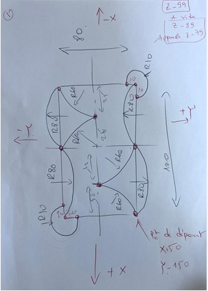
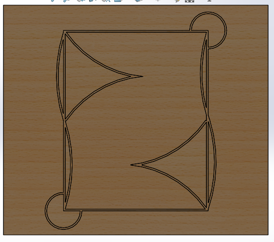
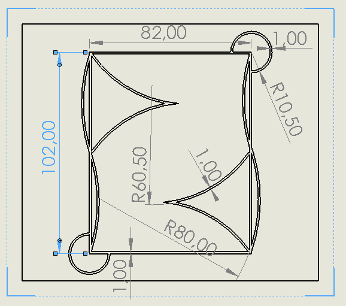
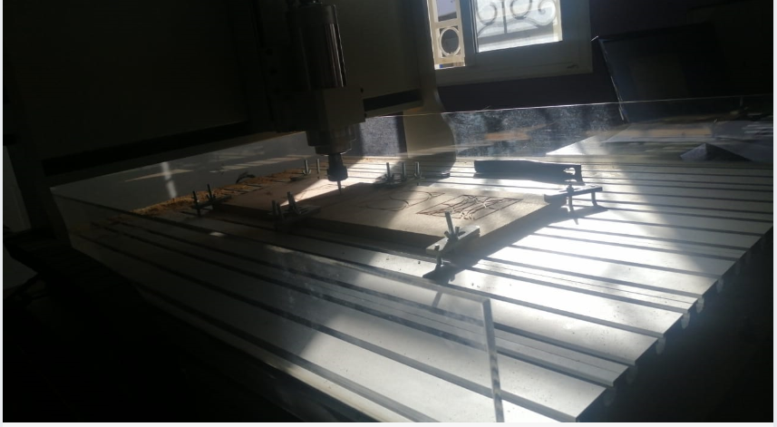

# Projet CNC – Fabrication Mécanique & Productique
### 1. Description du projet
Ce dépôt GitHub regroupe un projet académique réalisé dans le cadre du module Productique et Fabrication Mécanique.
Le projet porte sur la conception, la programmation et l’usinage CNC d’une pièce mécanique, en reliant les notions théoriques (CAO/FAO, G-code) à une application pratique sur machine-outil à commande numérique.

L’ensemble du cycle de fabrication industriel est abordé, depuis la conception jusqu’à la validation de la pièce usinée.
### 2. Objectifs du projet
Ce projet vise à :

- Comprendre le fonctionnement des machines CNC et leur rôle dans l’industrie

- Appliquer les principes de la CAO et de la FAO

- Maîtriser les bases de la programmation CNC (G-code)

- Simuler puis réaliser l’usinage réel d’une pièce mécanique

- Relier les concepts théoriques de fabrication mécanique à une application concrète
### 3. Structure du dépôt
 /code
 ├─ Code_simuler.txt     → Programme CNC pour simulation
 ├─ Code_usiner.txt      → Programme CNC pour usinage réel

/image
 ├─ Capture.PNG          → Drawing avec annotations
 ├─ part1.PNG            → Modèle 3D sous SolidWorks
 ├─ schema.PNG           → Schéma dimensionnel de la pièce
 └─ usinage.PNG          → Usinage réel sur machine CNC

/model
 ├─ Part1.SLDPRT         → Fichier SolidWorks (Part)
 └─ Part1.SLDDRW         → Fichier SolidWorks (Drawing)

README.md

### 4. Description de la pièce mécanique
La pièce conçue présente une géométrie combinant :
- Des segments rectilignes
- Des arcs de cercle de différents rayons
- Des zones nécessitant une précision géométrique et dimensionnelle

La définition géométrique repose sur :
- Un repère XY clairement défini
- Des points caractéristiques (P1 à P12)
- Des profondeurs d’usinage distinctes pour la simulation et l’usinage réel
- Les détails complets sont disponibles dans les drawings annotés présents dans le dossier /image.

### 5. Définition géométrique – Points et coordonnées
<ins>Le rectangle:</ins>
- P1 (X+50 ; Y-150) {Point de départ}
- P2 (X-50 ; Y-150)
- P3 (X-50 ; Y-230)
- P4 (X+50 ; Y-230)
  
<ins>Les courbes de rayon R80:</ins>
- P5 (X0 ; Y-150) {Point entre P1 et P2, centre de la courbe 1}
- P6 (X0 ; Y-230) {Point entre P3 et P4, centre de la courbe 2}
  
<ins>Les arcs de rayon R60:</ins>
- P7 (X+25 ; Y-190) {Point de rencontre des deux arcs entre P1 et P5}
- P8 (X-25 ; Y-180) {Point de rencontre des deux arcs entre P3 et P6}
  
<ins>Arcs 3/4 de cercle de rayon R10:</ins>

Cercle centré en P2 :
- P9 (X-40 ; Y-150)
- P10 (X-50 ; Y-160)

Cercle centré en P4 :
- P11 (X+40 ; Y-230)
- P12 (X+50 ; Y-220)
  
<ins>Les Z :</ins>

{Pour La simulation}
- Z1=-79 {Z pour approcher}
- Z2=-89 {Z pour simuler l’usinage}
  
{Pour l’usinage}
- Z3=-89 {pour approcher}
- Z4=-100 {pour usiner}

### 6. Processus d'usinage CNC
#### 6.1. Conception de la pièce sur SOLIDWORKS
La pièce a été modélisée en 3D sous SolidWorks en respectant les contraintes géométriques et fonctionnelles.
Un drawing technique détaillé a ensuite été réalisé, intégrant cotes, tolérances et annotations nécessaires à la fabrication. Une vérification de la faisabilité d’usinage a permis d’assurer la compatibilité avec la machine CNC.

[fichier SolidWorks Part](model/Part1.SLDPRT)

[fichier SolidWorks Drawing](model/Part1.SLDDRW)

#### 6.2. Programmation CNC 
La machine CNC est pilotée à l’aide du G-code, qui commande les déplacements et les opérations d’usinage, tandis que les M-codes gèrent les fonctions auxiliaires.
Les paramètres de vitesse de broche (S) et d’avance (F) influencent directement la qualité de l’usinage.
<ins>G-codes principaux :</ins>
- G00 : Déplacement rapide
- G01 : Interpolation linéaire (déplacement en ligne droite)
- G02 : Interpolation circulaire horaire (CW)
- G03 : Interpolation circulaire antihoraire (CCW)
<ins>M-codes utilisés :</ins>
- M02 : Fin de programme
- M03 : Démarrage de la broche en rotation horaire
<ins>Paramètres :</ins>
- S (Vitesse de rotation de la broche) : S1000 
- F (Vitesse de déplacement d'outil) : F500 

[Le code à simuler](code/Code_simuler.txt)

[Le code à usiner](code/Code_usiner.txt)

#### 6.3. Déroulement de l’usinage CNC
Avant de lancer l’usinage, la machine CNC est soigneusement préparée par l’installation des outils de coupe adaptés (fraises, forets, alésoirs) et la fixation rigoureuse de la pièce sur un dispositif approprié afin de garantir sa stabilité. Le programme G-code est ensuite chargé dans le contrôleur et les origines de la pièce sont définies pour assurer la précision des trajectoires. L’usinage débute par un test à vide (« dry run ») permettant de vérifier l’absence de collisions, puis les opérations d’ébauche, de finition et de perçage sont exécutées sous surveillance. À l’issue de l’usinage, la pièce est contrôlée à l’aide d’instruments de métrologie afin de vérifier sa conformité dimensionnelle, et des ajustements peuvent être effectués si nécessaire. Enfin, des opérations de finition et de nettoyage sont réalisées pour éliminer les bavures, améliorer l’état de surface et préparer la pièce à son utilisation finale.

[Accéder au repository complet](https://najmechorouk.github.io/Programmation-et-usinage-CNC)
